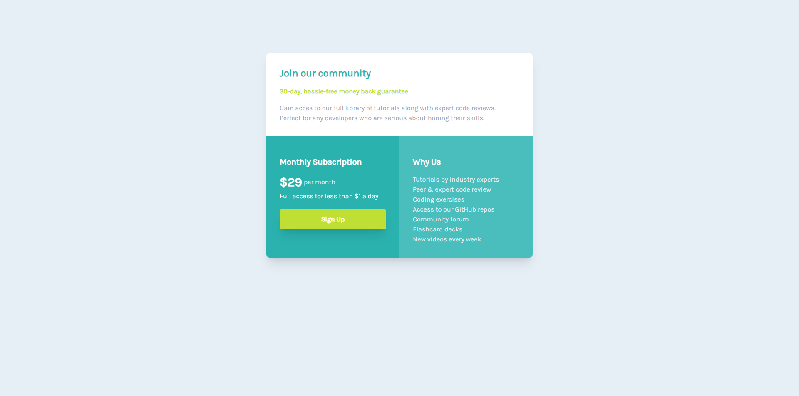

<h1 align="center": center">Single Price</h1>

  <h3>Desktop</h3>
  
  <h3>Mobile</h3>
  

<h3> O projeto se trata de um clone do projeto <a href="https://www.frontendmentor.io/challenges/single-price-grid-component-5ce41129d0ff452fec5abbbc">Slinge-Price-Component</a>, onde recriei usando HTML e CSS/TailWind. Funciona basicamnete como cards com informações da comunidade.</h3>
<h3 align="center">Confira meu Projeto <a href="https://pedrosrc.github.io/Projeto-Single-Price/src/">Aqui🔗</a></h3>
<h2>⚙️Tecnologias Usadas:</h2>
<ul>
  <li>HTML, CSS</li>
  <li>Tailwind</li>                                                                                   
</ul>
